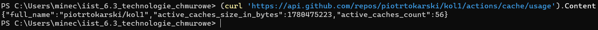
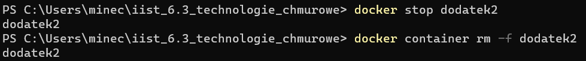
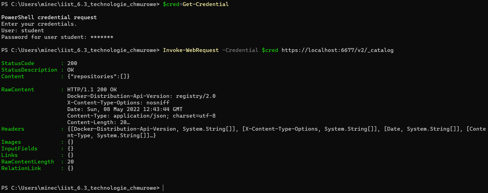

# ZADANIE 1

## 1.

Komentarze są zawarte w kodzie. Serwer postawiony został za pomocą Node.js. Po uruchomieniu serwer zwraca odpowiednie logi. 

Udało się poprawnie wyświetlić logi.

Udało się wyświetlić w przeglądarce informacje o kliencie.
## 2.

Komentarze są zawarte w kodzie. Po uruchomieniu programu każde zapytanie HTTP ma IP ustawione na IP urządzenia wirtualnego w sieci Docker. Dzieje się tak, ponieważ Docker używa domyślnie sieci mostkowej, która działa na zasadzie proxy TCP. Musimy więc wykorzystać proxy HTTP do zapisania IP w nagłówku, aby zostało ono odczytane przez serwer. Przy braku wykorzystania proxy HTTP to utracimy IP użytkownika i zastąpi się lokalnym IP. Wtedy serwer sprawdzi publiczne IP, aby pobrać lokalizację. Takim zabiegiem zabezpieczamy się nawet na przypadek połączenia z prawdziwej sieci lokalnej.

## 3.

Wszystkie polecenia się widoczne na zrzutach ekranu.

#### a.

Zbudowałem najpierw obraz za pomocą docker build.

#### b.

Następnie stworzyłem kontener za pomocą docker create.

Następnie utworzony kontener uruchomiłem za pomocą docker start.

#### c.

Udało się poprawnie wyświetlić logi za pomocą docker logs.

#### d.

A na koniec sprawdziłem ile warstw posiada zbudowany obraz za pomocą polecenia docker history.

## 4 oraz DODATEK 1
Wykonałem punkt 4. za pomocą GitHubActions wraz z ustawieniem eksportu cache'a oraz przesłaniem danych na utworzone wcześniej repozytorium. 
Zadanie przebiegało tak:
- najpierw napisałem plik PIERWSZY_DODATEK.yml
- w celu wybrania architektur wpisałem je w parametrze platforms dla kroku build and push `docker/build-push-action@v2`
- aby zbudować obrazy dodałem tokeny do repozytorium GitHuba dla repozytoriów obrazów DockerHub i ghcr.io 
- następnie wykonałem push do repozytorium GitHub.
- postęp z logami śledziłem w GitHub Actions 
- Jak widać poniżej udało całość powiodła się: 
- Wynik publikacji na DockerHub: 
- Wynik publikacji na ghcr.io: 

Jak widać system ghcr ma problemy, aby wrzucić te pakiety. Problem leży po stronie systemu, co jest opisane w tym [issue](https://github.com/docker/build-push-action/issues/251#issuecomment-966075354). Niestety issue jest oznaczone jako zamknięte, ale kilku użytkowników nadal zgłasza problemy - które ja również napotkałem.

Aby skorzystać z GitHub Container Registry musimy podać adres rejestru do logowania oraz do tagu w kroku budowania. Trzymamy to w zmiennych środowiskowych, które wykorzystujemy jako parametry do kroków budowania. W moim przypadku podaję tylko jeden tag, ponieważ nazwa konta na DockerHub jak i GitHub jest taka sama: piotrtokarski, więc posługuję się github.actor jako nazwą użytkownika. Do cache'a użyłem parametrów cache-from oraz cache-to i ustawiłem je na gha.

Tutaj potwierdzenie wykorzystania cache'a poprzez Rest API.
# DODATEK 2

## 1.
#### a.

Pobieramy na początku obraz rejestru. Tworzymy kontener i sprawdzamy jego działanie po uruchomieniu za pomocą API REST.

#### b.

Tutaj pobieramy obraz ubuntu i zapisujemy go w rejestrze. Wyświetliłem dodatkowo listę, aby potwierdzić obecność obrazu - za pomocą API REST.

## 2.

Najpierw utworzyłem konfifurację dla openssl, aby wygenerować własny certyfikat dla HTTPS.

Generujemy certyfikat.

Następnie zaimportowałem certyfikat.

Następnie wygenerowałem hasło. Hasło dla użytkownika student zostało ustawione na student.

Następnie należy utworzyć kontener od nowa. Przed tym usunąłem stary kontener.

Tutaj utworzyłem nowy kontener, a następnie go uruchomiłem. Dodałem certyfikat, plik htpasswd za pomocą bind-mount.

Tutaj sprawdziłem działanie basic auth. Uruchomiłem kontener i jak widać nie wpuszcza nas po HTTPS, bo nie podaliśmy danych logowania. Po HTTP nie działa, bo serwer działa na HTTPS, bo mu podaliśmy certyfikat i podaliśmy zmienne środowiskowe.

Tutaj ustawiam dane logowania - przypisuję je do zmiennej i ponawiam zapytanie z ich pomocą.

Jak widać na screenie, wszystko zadziałało poprawnie. Serwer nie pozwolił na zapis obrazu bez logowania.